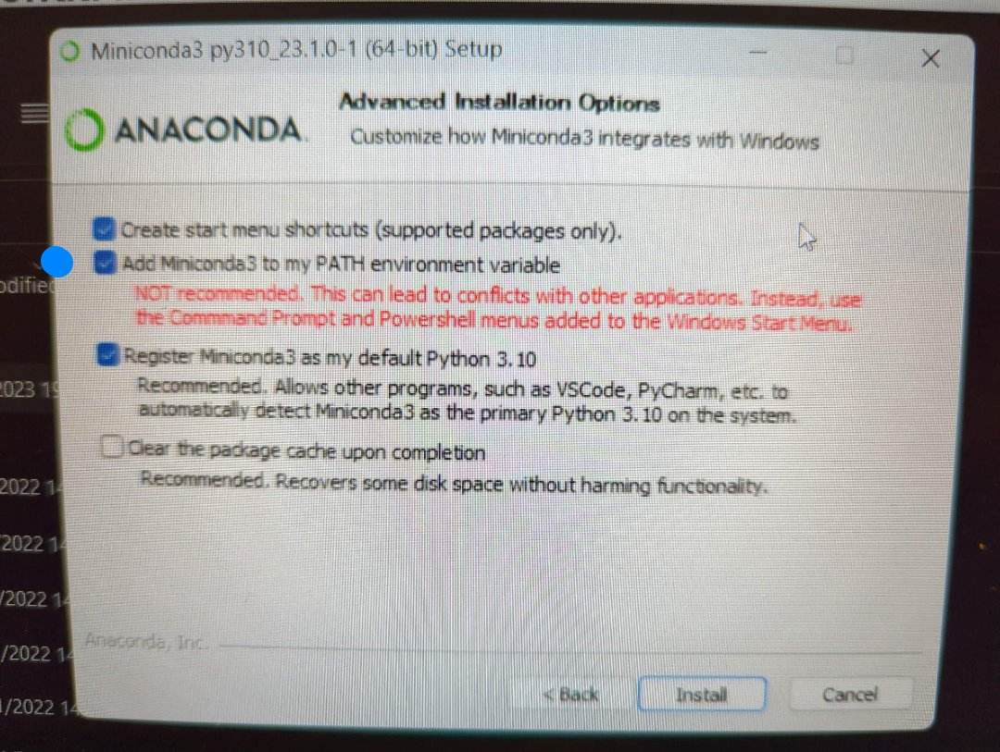

# pp_install_guide

# Installation de PP

> But : lancer PP dans un environnement python séparé et adequat.

## Installer miniconda/minimamba

- Pour **windows** les executables sont disponnibles ici :
[lien cliquable](https://docs.conda.io/en/latest/miniconda.html)

Lors de l'installation, il est important de cocher *add miniconda3 to my PATH...*

- Pour **Linux** : ouvrez votre terminal et executez : `curl micro.mamba.pm/install.sh | bash` dans votre terminal

- Pour **MacOS**: ouvrez votre terminal et executez : `curl micro.mamba.pm/install.sh | zsh` dans votre terminal

## Creation de l'environment

Les utilisateurs windows devront utiliser la commande **conda**, les autres devront remplacer conda par **mamba** dans les instructions qui suivent.

Les utilisateurs windows peuvent maintenant ouvrir "cmd" pour entrer les commandes.

`conda create -n ppenv python=3.8 matplotlib numpy tk` creera l'environment avec les packages necessaires

`conda activate ppenv` assignera l'interpreteur python a cet environment. Il sera toujours necessaire d'entrer cette commande avant d'executer le programme pour s'assurer d'utiliser l'environment propice

Vous pouvez maintenant aller dans le repertoire ou vous l'avez telecharger (precisement dans le sous repertoire /PP/1D/PP_1D_GUI) et executer le programme avec la commande `python3 main.py`

pour sortir de l'environment : `conda deactivate`
